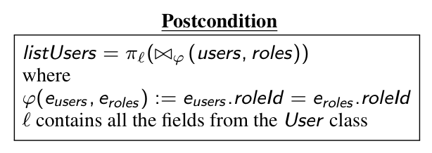

For sure!

#### Short summary

I want to use program analysis to translate a procedural program with inefficient SQL queries into a single semi-structured query written in SQL++ (language used by our data integration middleware, [FORWARD](http://forward.ucsd.edu/)), then take advantage of the FORWARD query compiler to greatly improve performance.

#### Slightly longer description

In the context of my research exam, I have been reading about works on holistic optimization in database applications, which attempts to fix performance problems caused by poorly written code on an application that uses databases. These works analyze the application program, then rewrite it to make it more "database-aware" and produce less, more efficient database queries. For example, the work of alvin cheung at MIT. He takes in an inefficient program :

```
List<User> getRoleUser() {
    List<User> listUsers = new ArrayList<>();
    List<User> users = this.userDao.getUsers();
    // ORM call produces query : SELECT * FROM users
    List<Role> roles = this.roleDao.getRoles();
    // ORM call produces query : SELECT * FROM roles
    for (User u : users) {
        for (Roles r : roles) {
            if (u.roleId().equals(r.roleId())) {
                U userok = u;
                listUsers.add(userok);
            }
        }
    }
}
```

Then analyzes the program to generate loop invariants and a post-condition, expressed as relational algebra (with order) :



Then rewrites the program into a more efficient query :

```
List<User> getRoleUser() {
    List<User> listUsers = db.executeQuery(
      "SELECT u" +
      "FROM users u , roles r" +
      "WHERE u.roleId == r.roleId" +
      "ORDER BY u.roleId, r.roleId");
   return listUsers;
}
```

We have developped in the database lab a web-oriented data integration middleware called [FORWARD](http://forward.ucsd.edu/), which allows developpers developers to declaratively specify application using a language called SQL++, which is a language backwards-compatible with SQL and which can explore/produce data with nested relations (semi-structured data, think JSON or XML).

The nice thing with query languages for semi-structured data is that any database report can be modelled with a single query, thanks to nesting. The other nice thing about FORWARD is that it is itself a query compiler which can make optimizations on the application machine (if Forward middleware is running on same machine as the application program using it). Finally, it can iteract with both SQL and NoSQL databases.

My idea would be to use program analysis to go from an application program to a single SQL++ query. If you can do this mapping, then you get for free :

 1. The access to data from both SQL and NoSQL databases while coding in a procedural language.
 2. A fully declarative specification of your entire data access (not possible if translating to classical SQL with no nesting).
 3. A query compiler located on your machine which can optimize your program without you having to.