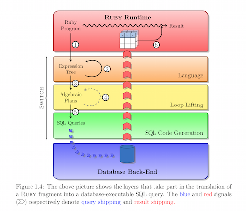

For sure!

The idea would be to make an "ORM" for SQL++. Recall the query from the holistic optimization paper (I removed the HTML tags and the UDF for clarity) :

```
Nation.all.each.do |n|
	if session['selected_nations'][n.nation_key] == true then
		aggregates = Order
			.select('order_year, sum(total_price) as sum_price')
			.joins('customer')
			.where('nation_ref = ?', n.nation_key)
			.group('order_year')
			.order('sum_price DESC')
			.limit(3)
	end
end
```

which we know to be inefficient. Our proposal in that paper was to allow the user to write his query using SQL++:

```
SELECT	n.nation_key, n.name, (
	SELECT	order_year, sum(total_price) as sum_price
	FROM	db.orders AS o,
			db.customers AS c
	WHERE o.cust_ref = c.cust_key
	AND c.nation_ref = nation_key
) AS aggregates
```

Using the declarative form, we could then apply a number of optimizations and increase performance. The problem with our approach is that we are forcing the user to change environment from Rails to a new, declarative language. A common theme I have seen while I was going over holistic optimization frameworks is the ability to use the framework with the same tools/same environment the programmer is accustomed to.

### The idea

Consider the [Switch](https://github.com/manuelmayr/Switch) framework (currently available as an open source tool) which allows deep embedding of queries in Ruby. For example, given the following ruby program:

```
discount = 20.0/100
high_vol = 10

high_vols = Order.group_by(&:user_id)
					.select {|u,os| os.length >= high_vol}
open_orders = high_vols.map {|u,os| os.select 
						{|o| o.state == "0"}}.flatten
items = open_orders.map {|o| line_item.in_order(o)}.flatten
cost = items.sum {|i| i.price * i.quantity} * discount
```

Switch will derive the following SQL query :

```
SELECT SUM(li.price * li.quantity) * 0.2
FROM ( 
			SELECT o2.user_id, COUNT(*) AS cnt
			FROM Orders AS o2
			GROUP BY o2.user_id
		) AS oc,
		Orders AS o1,
		Line_Items AS li
WHERE o1.id = li.order_id
AND o1.state = 'O'
AND oc.user_id = o1.user_id
AND oc.cnt > 10
```

The way it accomplishes this feat is by deriving an expression tree and an algebraic plan at runtime from the ruby program and finally generate SQL queries (see diagram below). My idea would be to modify switch to let it translate algebraic plans to SQL++ instead. This way, programmers can benefit from the SQL++ middleware without learning a new language.

