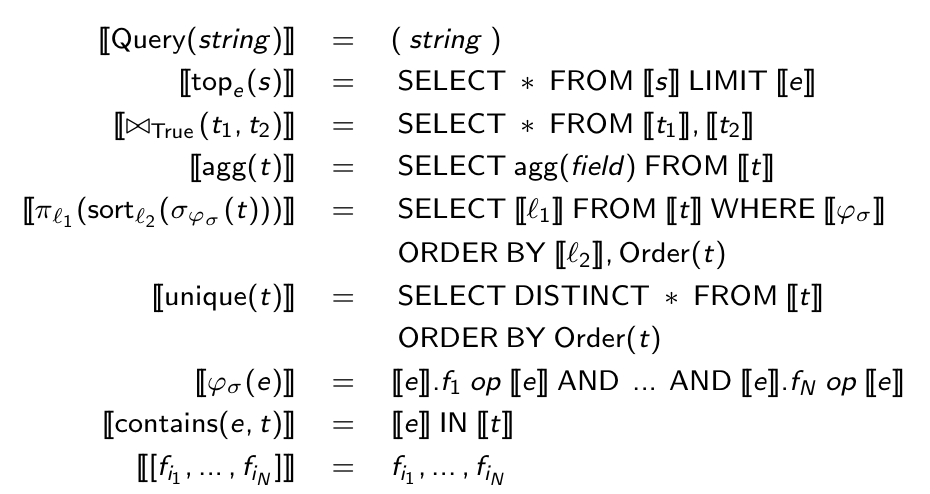

# StatusQuo : Making Familiar Abstractions Perform Using Program Analysis


Status Quo is a tool which can be used on any existing codebase to apply holistic optimization.

Criteria : 

 - Performance
 - Security
 - Reliability

StatusQuo's architecture has two main components, the code transformer (QBS) and runtime modules (Pyxis).

 
## QBS

QBS is a tool which analyzes any Java source code which interacts with a database. It identifies source code fragments which make unoptimal access to databases and transforms such fragments into more efficient code.

### Process

 - Identify code fragments to transform
 - Compute verification conditions
 - Synthesize loop invariants and post-conditions
 - Convert to SQL

#### Identification of Code Fragments

In this step, QBS identifies code fragments which make inefficient database access, such as the following :

```
List<User> getRoleUser() {
	List<User> listUsers = new ArrayList<>();
	List<User> users = this.userDao.getUsers();
	List<Role> roles = this.roleDao.getRoles();
	for (User u : users) {
		for (Roles r : roles) {
			if (u.roleId().equals(r.roleId())) {
				User userok = u;
				listUsers.add(userok);
			}
		}
	}
}
```

The identification requires first finding the method which access the database (persitent data method), which are typically the ORM methods. It also locates all entry points to the application. **Question : what if a method which is not an ORM method contains a database access call (say through JDBC)?**

For each persistent data method that is reachable from an entry point, the systems identifies a neighborhood of calls. This "neighborhood" is fuzzily defined in the paper, we only know that it contains a few of the parent methods and a few of the methods called by them.

This neighborhood is then inlined and analyzed until a continuous code fragment that can be potentially transformed to SQL is found. Again, this part is fuzzy; we don't know which analysis are performed yet.

For each persistent data method, a variable in which the result of the inferred database query is chosen. This variable is called the **result variable**.

```
SELECT SUM(li.price * li.quantity) * 0.2
FROM ( 
			SELECT o2.user_id, COUNT(*) AS cnt
			FROM Orders AS o2
			GROUP BY o2.user_id
		) AS oc,
		Orders AS o1,
	 Line_Items AS li
WHERE o1.id = li.order_id
AND o1.state = 'O'
AND oc.user_id = o1.user_id
AND oc.cnt > 10
```

#### Compute Verification Conditions

The verifications must be computed using the kernel language. Verification conditions are conditions that must be true for a statement to be correct. Done using standard techniques

#### Synthesize Loop Invariants

1. Synthesizer uses symbolic representation of the space of candidate postconditions and invariants that satisfy the verification conditions.
2. A theorem prover is used to check looks for a candidate which can be proven correct.

Postconditions generated are limited to those than can be translated to SQL according to the theory of ordered relations (TOR). It is also not necessary to translate the strongest (in terms of logical implication) condition, any post-condition of the form `listUsers = query` will do.

For the purposes of this talk, we will concentrate on the SQL generation from the post-condition. 

#### Conversion to SQL

The post condition is then translated to SQL using the theory of ordered relations. Any expression in TOR can be translated into valid SQL. 

### Theory of ordered relations

The theory of ordered relations (TOR) is used to describe post-conditions and invariants. This theory describe both the *contents* and the *order* of records retrieved from the database. The order matters because in the presence of joins, the order described by the expressed by the algorithm is the original program is not arbitrary, and we don't know what assumptions the program is making on top. For example :

```
List<User> users = getRoleUser();
for (User u : user)
	System.out.println(u);
```

TOR is thus essentially relational algebra running on lists. Three new operators are defined, with new semantics :

 - `PROJECT` : relational algebra projection where order of incoming tuples is retained.
 - `SELECTION` : relational algebra selection filter records, retaining the order of incoming tuples.
 - `JOIN` : for each record on the left, the condition is evaluated for all records on the right and then a new record is produced.
 - Note that there is no group by.

Translateable expresssions : any expressions that does not use `append` or `unique` is a translatable expression. Translatable expressions can be translated to SQL, proof is available.

Following syntax directed rules in figure below, it is possible to translate any translatable expressions into SQL, although ordering is important.


Translatable expression : 

Order(t) operator : 




The beauty of this method is that a post-condition for a code fragment can be expressed in a logic (the theory of ordered relations) which can be converted to SQL.


## Plan

 - Query By Synthesis slide :
   - Kernel language code
   - Post Condition
   - Translated Code
 - Theory Of Ordered Relations
   - This theory describe both the *contents* and the *order* of records retrieved from the database. 
   - projection, selection and maybe join description for TOR atoms. => Lets use data to explain order (visually easier than the formulas).
   - Add supported operator 
 - Process flow
   - Show we focus on the SQL generation
 - SQL Translation (Part 1)
   - translatable expressions (why no unique/append)
   - the order inference and preservation
   - the translation rules
 - SQL Translation (Part 2)
   - "Execute" the translation