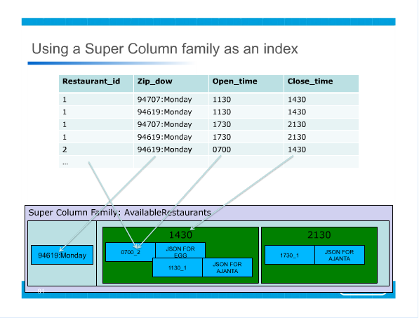
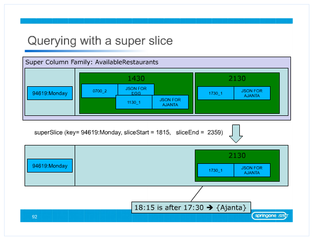
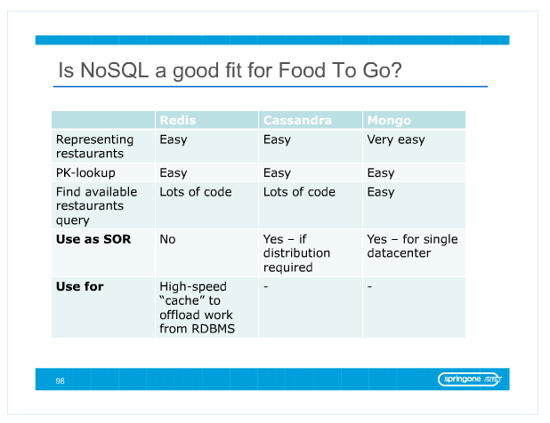
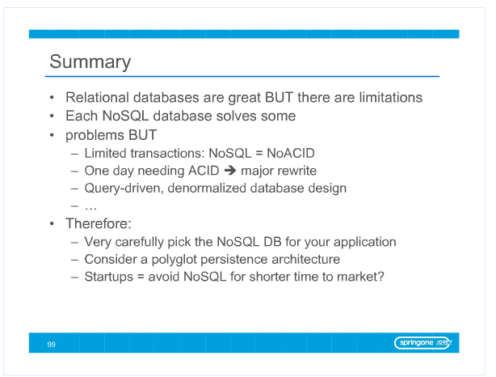

## Initial Query

Finding available restaurants on Monday, 6:15pm for 94169 zip code.

Intended Query if using a SQL database.

```
select r.*
from restaurant r
inner join restaurant_time_range tr
on r.id = tr.restaurant_id
inner join restaurant_zipcode sa
on r.id = sa.restaurant_id
where '94619' = sa.zip_code
and tr.day_of_week='monday'
and tr.openingtime <= 1815
and 1815 <= tr.closingtime
```

Assumed Schema (star schema)

```
CREATE TABLE restaurant (
	id int,
	value 1,
	value 2,
	value 3,
);
CREATE TABLE restaurant_time_range (
	restaurant_id int,
	DayOfWeek string,
	openingtime date,
	closingtime date
);
CREATE TABLE restaurant_zipcode sa (
	restaurant_id int,
	zipcode string
);
```

## On Redis

You still have to do the `open_time` filtering on the application side. Its not clear what the rest of the `r.*` goes.

Query

```
SELECT restaurant_id, open_time
from time_range_zip_code
WHERE zip_code_day_of_week = '94169:Monday'
AND 1815 < close_time;
```

Then do join last join with value manually

PseudoCode View of the application

```
Find_Available_Restaurants() :
	restaurants = Redis_Range_Query(
		SELECT restaurant_id, open_time
		from time_range_zip_code
		WHERE zip_code_day_of_week = '94169:Monday'
		AND 1815 < close_time;
	)
	for rest in restaurants :
		if rest.open_time > 1815:
			return Redis_Retrieve_Value_For_Key(rest.id)
```

New "Schema"

```
Key Value Set restaurant (
	key : restaurant_id
	value : {
		value1,
		value2,
		value3
	}
);
Key Value Set time_range_zip_code (
	key : zip_dow,
	value :	Sorted Set [
		score : close_time
		value : { 
			open_time,
			restaurant_id
		}
	]
);
```

The second table is what people in the industry call an index.
The pseudo code can be seen as the view over the data,
The index is the materialization of this view.

This process apparentlys brings a 20x performance increase over MySQL, but imprecise what is being compared :

 - The single table query in MySQL (with denormalized data) and the Redis solution.
 - The join query in MySQL (with normalized data) and the Redis solution.

## On Cassandra

The index is where you put your data. Looks gross.

New "Schema"





## On MongoDB

Pretty straightforward.


## Summary


