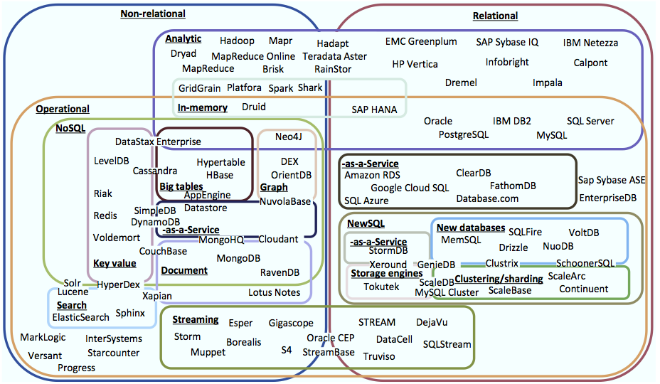

## Question Log

**Question** : What is Polyglot Persistence?

In the Big Data era, the volume, velocity and variety has greatly increased, and the traditional data management approach involving a single centralized Relational DataBase Management Systems (RBDMS) no longer fits the needs of many applications. Consequently, a number of newer storage systems (dubbed NoSQL) have been designed to solve the various limitations of RDBMS systems.

However, the limitations of RDBMS could only be solved at the cost of a tradeoff with some of the guarantees that RDBMS systems offered, which has led NoSQL systems to specialize. As a result, systems have been developped for a variety of applications such as document processing, key-value stores, graph databases, stream processing, real-time systems, batch analytics systems ... A figure of showing the landscape of some of those storage systems is given below.

Such specialization has resulted in each system only being capable of managing applications whose requirements matched the system's capabilities. But some applications have requirements that cannot be matched by a single "one size system", resulting in the necessity of using and coordinating multiple systems. Such phenomenon has been called the Polyglot Persistence (as in persistence in multiple languages) and some solutions have since been developed to handle this task.

------

**Question**: What is the difference between local-as-view and global-as-view approaches in data integration?

**Answer**: Both approaches deal with modeling external sources in an aggregator system (the mediator) which combines the data from all those sources and makes them available in one place. To simplify the answer, lets consider that all those sources contain data represented conceptually in relational tables.

The *Global-As-View* approach provides on the mediator a set of views made from those tables which end-users can query. When a new source is added to the system, views have to be updated to take the new source's data into account.

On the other hand, the *Local-As-View* approach takes a global (or mediated) schema and considers that each source contains some small piece of the global schema's data (a view over the global schema). When a new source is added to the system, tables from the new sources have to be expressed in terms of the global schema.

**Follow-Up Question**: Is FORWARD Global-As-View or Local-As-View (from the [FORWARD website's description](http://forward.ucsd.edu/architecture.html)?

FORWARD is clearly Global-As-View. FORWARD's grandfather is Garlic, which was also a Global-As-View system.
___

**Question**: What are the differences/similarities between the challenges of the 1990's integration systems and the 2010's polyglot persistence problem?

**Answer**:The initial systems were interested in providing a uniform query interface for *locating* data sources, *extracting* each source individually and *combining* the results. The aim was to make such a process feasible and provide the most accurate response given the large (and possibly varying) number of sources each with their own dataset and varying degrees of query capabilities. An approach used by some of those systems is called the Global-As-View (GAV) approach (see above). 

The polyglot persistence problem is based on the premise that there is no single system which is effective when considering all types of data access, therefore multiple systems should be used in coordination to make all types of data access requirements of a given application feasible and performant.

--------

**Question**: What are the differences/similarities between the solutions of the 1990's integration systems (such the Garlic system and its Global-As-View approach) and the 2010's polyglot persistence problem (and it's restful API solution)?

GAV mediators were built with the intention of aggregating data originally from different sources into a centralized location and make it available for querying (and possibly updating) from that location under a common format.

PP systems are conceived before any data is present (with the exception of the legacy system integration) with the idea that given the requirements of an application and the resulting expected workloads and query/update access patterns, more than one system will be required to achieve the optimal performance and productivity*.

PP systems tend to be implemented (in the context of web applications) using a (web) storage service approach in which each persistence interaction from an application must go through the storage service. The storage service is typically designed as a Restful API with an exposed interface which defines the way application should interact with the service. This is the architecture suggested by Martin Fowler (the man who coined the term) and Microsoft in their *Data Storage for Modern High Performance Applications* book.

___

**Question**: In order to provide a uniform query interface, developers currently use a software development pattern called the *Repository Pattern*. What is this pattern?

**Answer**: In the Repository Pattern, an application centralizes all of its persistence storage and retrieval through a *Repository Module*. The Repository Module is not only responsible for storing and retrieving objects, but also ensuring properties about data such as integrity constraints. In order to guarantee that some constraints are satisfied, it may have to ensure atomicity and isolation for the transaction that require it, if the underlying data store does not already provide them.

The repository must be specify how the database(s) should be queried through the use of an API. These queries can be understood as views over the database. Given repository modules are application-specific, a new repository module has to be built for each application.

----

